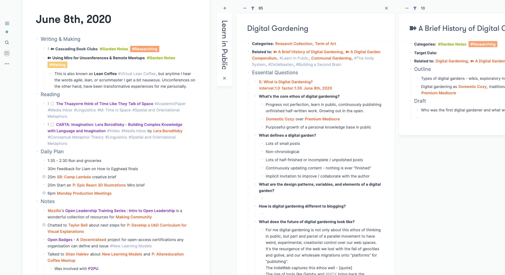

# Roam Research Themes

## Themes currently available:

- [Zenithdecker](./zenithdecker.css)   A mashup of Maggie's "Leyendecker" theme and [Azlen Elza's "Zenith" theme](https://github.com/azlen/roam-themes)
 
  

---

- [Mappletons](./mappletons.css) (light theme)

  
  
  
  
---

- [Night Owlish](./night-owl-ish.css) (dark theme)

  

## How to Use
Create a new page called `roam/css`, and create a code block, set the language to `css`, then paste your chosen theme's CSS code in there. Tada!

