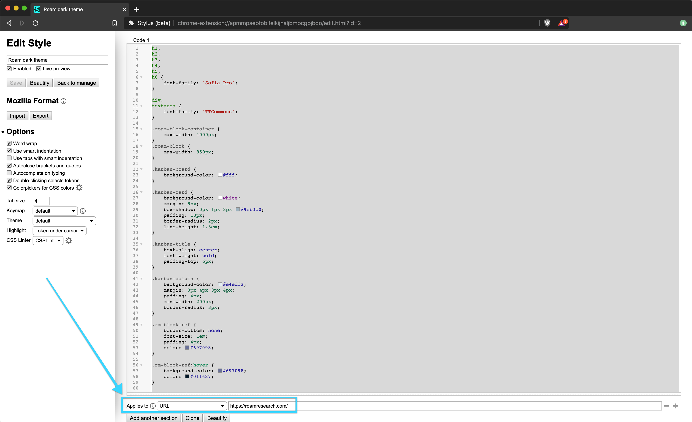

# Roam Research Themes

Themes currently available:

- [mappletons](./mappletons.css) (light theme)
- [night owlish](./night-owl-ish.css) (dark theme)

## Use Stylus Extension to Override Styles

[Maggie Appleton](https://twitter.com/mappletons?lang=en) introduced me to [Stylus](https://chrome.google.com/webstore/detail/stylus-beta/apmmpaebfobifelkijhaljbmpcgbjbdo?hl=en) to override CSS styles on an website.

You want to be sure to enable the styles only on htts://roamresearch.com.

